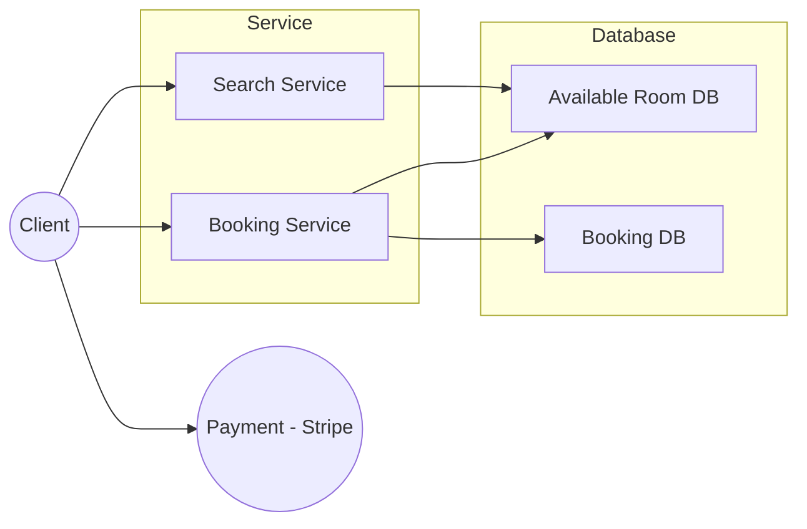

# Hotel Booking System

## Features functions

1. Allow user to book a room
2. Allow user to modify their booking
3. Allow user to check the available room 

## System Structure

1. Spring boot framework
2. MySQL database

## API Design

1. **Get Available Rooms**
    
    GET /rooms 
    
    1. Request body : start_data, end_date
    2. Response body : room_type, no_rooms
2. **Book Room**
    
     POST /bookings  
    
    1. Request body : start_date, end_data, room_type, no_rooms
    2. Response body : REDIRECT to payment
3. **Modify Booking**
    
    PUT /bookings/{bookingID}
    
    1. Request body : NULL
    2. Response body : Message
4. **Cancel Booking**
    
    DELETE /bookings/{bookingID}
    
    1. Request body : NULL
    2. Response body : Message
5. **Get Booking Details**
    
    GET /bookings/{bookingID}
    
    1. Request body : NULL
    2. Response body : bookingID, room_type, no_rooms, payment_status, start_date, end_date

## DB design

1. Available Room DB
    
    room_type, Dates, no_rooms, rates
    
2. Booking DB
    
    bookingID, room_type, no_rooms, status, start_date, end_date, price
